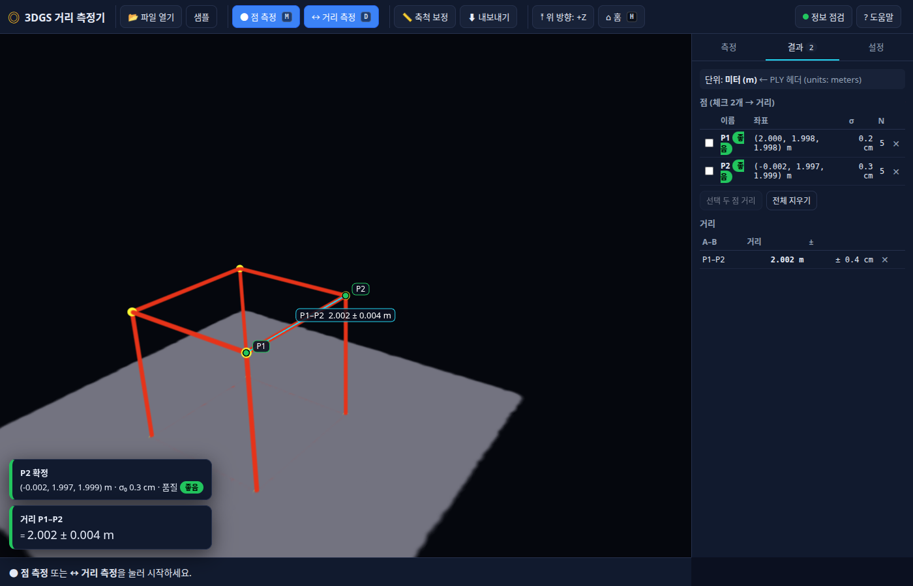

# 3DGS Accurate Point Measurement — 내 3DGS 모델에서 거리 측정하기

Deng & Qin (2026), *Accurate Point Measurement in 3DGS – A New Alternative to Traditional
Stereoscopic-View Based Measurements* ([arXiv 2603.24716](https://arxiv.org/abs/2603.24716),
[공개 도구](https://github.com/GDAOSU/3dgs_measurement_tool)) 의 **다시점 광선 공간교회(spatial intersection)**
방법을 직접 학습한 3D Gaussian Splatting 모델에 적용해 점·거리를 측정하기 위한 작업 저장소입니다.

## 🌐 웹앱: 설치 없이 브라우저에서 바로 측정

**[webapp/](webapp/)** — 3DGS 파일(.ply/.spz/.splat/.ksplat/.sog)을 끌어다 놓고, 같은 점을 여러 각도에서 클릭하면 좌표와 거리가 바로 표시되는 정적 웹앱. Cesium·3D Tiles·Node 서버 없이 동작하며 파일은 컴퓨터 밖으로 나가지 않습니다.
- 안내선(에피폴라 선)·확대창·자동 정밀 보정·자동 회전으로 다시점 클릭을 돕고, 축척 등 **없는 정보는 무엇이 없어서 안 되는지** 정확히 알립니다(E01~E13).
- 열기: ① **온라인 https://rocheol2.github.io/3DGS_Accurate_Point_Mesurement/** (배포됨) ② `webapp/dist/3DGS_거리측정기_단일파일.html` 더블클릭(서버·인터넷 불필요) ③ `tools/start_webapp.sh`(로컬 서버 + 브라우저 자동 실행). ⚠ `webapp/index.html` 을 직접 더블클릭하면 브라우저가 스크립트를 차단해 동작하지 않습니다.
- 문서: [웹앱_사용법.md](웹앱_사용법.md) · [웹앱_작업결과_보고서.md](웹앱_작업결과_보고서.md) · 앱 안 도움말 [webapp/help.html](webapp/help.html) · 첫 방문 시 기능 소개 투어 자동 실행
- 검증: 합성 2.000 m 정육면체 5시점 클릭 → 3D 오차 2.5~3.6 mm, 거리 2.0019 ± 0.0036 m (헤드리스 Chrome 자동 테스트)



## 📐 원 논문 도구(Cesium) 재현 경로

핵심 흐름: COLMAP 임의 단위의 3DGS PLY → **미터·Z-up 으로 유사변환**(GPS 또는 GCP) → **3D Tiles 변환**
→ Cesium 기반 논문 도구에서 여러 시점 클릭으로 점 측정 → CSV 내보내기 → **거리 계산·축척 보정**.

👉 **처음이라면 [3DGS_거리측정_쉬운설명.md](3DGS_거리측정_쉬운설명.md)** (용어 설명 + 한 동작씩 따라하기 + FAQ) 부터,
   옵션·수식·실행 로그가 필요하면 **[3DGS_거리측정_튜토리얼.md](3DGS_거리측정_튜토리얼.md)** (상세판) 을 보세요.

## 구성

| 경로 | 내용 |
|---|---|
| `3DGS_거리측정_쉬운설명.md` | **입문용.** 등장인물(Cesium·3D Tiles·Node 등) 설명, 한 동작씩 따라하기, 예상 화면, FAQ |
| `3DGS_거리측정_튜토리얼.md` | 전체 절차(0~10장 + 부록), 실제 실행 로그 포함 | (상세판)
| `tools/gs_ply_georef.py` | 3DGS PLY 유사변환. `info` / `from-gps`(COLMAP+드론 EXIF GPS 로 축척·회전 추정) / `apply`(GCP 값 직접 적용). 위치·log-scale·쿼터니언·**SH 계수 회전**까지 처리 |
| `tools/measure_distance.py` | 도구의 Points/Polylines CSV·GeoJSON → WGS84 ECEF → 거리(m)와 불확도, `--calibrate` 로 축척계수 |
| `tools/start_tool.sh` | 측정 도구(Vite 개발 서버) 실행 → http://localhost:5173 |
| `3dgs_measurement_tool/` | 논문 저자 도구 **git 서브모듈** (GDAOSU/3dgs_measurement_tool @ 174cca5) |
| `patches/0001-register-Site_Research_01-model.patch` | 도구 `Home.jsx` 에 내 모델(`/models/site01/tileset.json`)을 기본 항목으로 추가하는 패치 |
| `data/site01/site01_enu.ply.json` | Site_Research_01 변환 메타(축척 4.2015 m/단위, 회전, 원점 위경도, 권장 `--coordinate`) — PLY 본문(632 MB)은 용량 때문에 제외 |
| `setup.sh` | 새 환경에서 서브모듈·패치·Node 22(conda)·npm install 을 한 번에 |
| `webapp/` | **설치 없는 웹앱** (Spark + three.js, 정적) · `help.html` 사용 설명 · `sample/` 진주 현장 샘플 · `docs/shots/` 검증 스크린샷 |
| `웹앱_사용법.md`, `웹앱_작업결과_보고서.md` | 웹앱 사용법·작업 보고서 |
| `index.html`, `.nojekyll` | GitHub Pages 진입(webapp/ 으로 리다이렉트) |

## 빠른 시작

```bash
git clone --recurse-submodules git@github.com:rocheol2/3DGS_Accurate_Point_Mesurement.git
cd 3DGS_Accurate_Point_Mesurement
./setup.sh                               # 서브모듈 + 패치 + conda env cesium_measure + npm install

# 1) 내 PLY 를 미터·Z-up 으로 (Site_Research_01 예시, 9초)
python3 tools/gs_ply_georef.py from-gps \
  --ply    ~/storage/03_Results/Vanilla_3DGS/Site_Research_01/point_cloud/iteration_30000/point_cloud.ply \
  --images ~/storage/02_Processed/Site_Research_01/3dgs_source/sparse/0/images.bin \
  --photos ~/storage/01_Raw/Photos/01_LH \
  --out    data/site01/site01_enu.ply

# 2) 3D Tiles 변환 (34초, 151 MB) — 위 명령이 출력한 recommended_coordinate 사용
conda activate cesium_measure
npx --yes 3dgs-ply-3dtiles-converter@0.6.5 data/site01/site01_enu.ply \
  3dgs_measurement_tool/public/models/site01 \
  --coordinate "[35.17779716,128.14690829,5.9]" --no-open-inspector --memory-budget 16

# 3) 도구 실행 → Chrome 에서 http://localhost:5173 → Points 탭 → Start Measure → 5개 이상 시점에서 같은 점 클릭 → End Measure
tools/start_tool.sh

# 4) 거리
python3 tools/measure_distance.py ~/Downloads/points.csv --pairs 1-2
python3 tools/measure_distance.py ~/Downloads/points.csv --calibrate 1 2 12.500   # 실측 길이로 축척 보정
```

## 저장소에 넣지 않은 것
- `data/**/*.ply` (632 MB), `3dgs_measurement_tool/public/models/site01/` (151 MB 3D Tiles): 위 1)·2) 로 재생성.
- 논문 PDF 원문.

## 참고
- 변환기: [3dgs-ply-3dtiles-converter](https://www.npmjs.com/package/3dgs-ply-3dtiles-converter) (v0.6.5, KHR_gaussian_splatting + SPZ)
- CesiumJS 3DGS 타일셋: https://cesium.com/learn/cesiumjs-learn/3d-guassian-splat-tilesets-lods/
